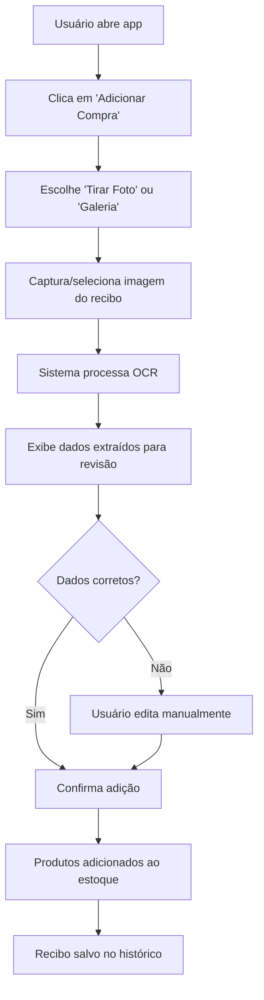
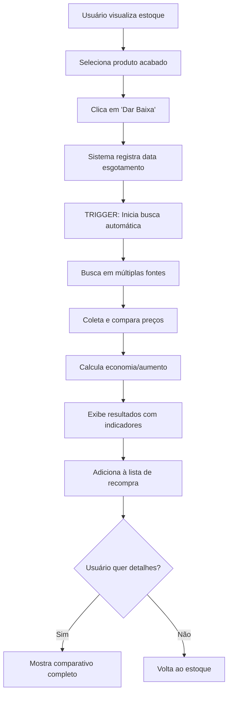
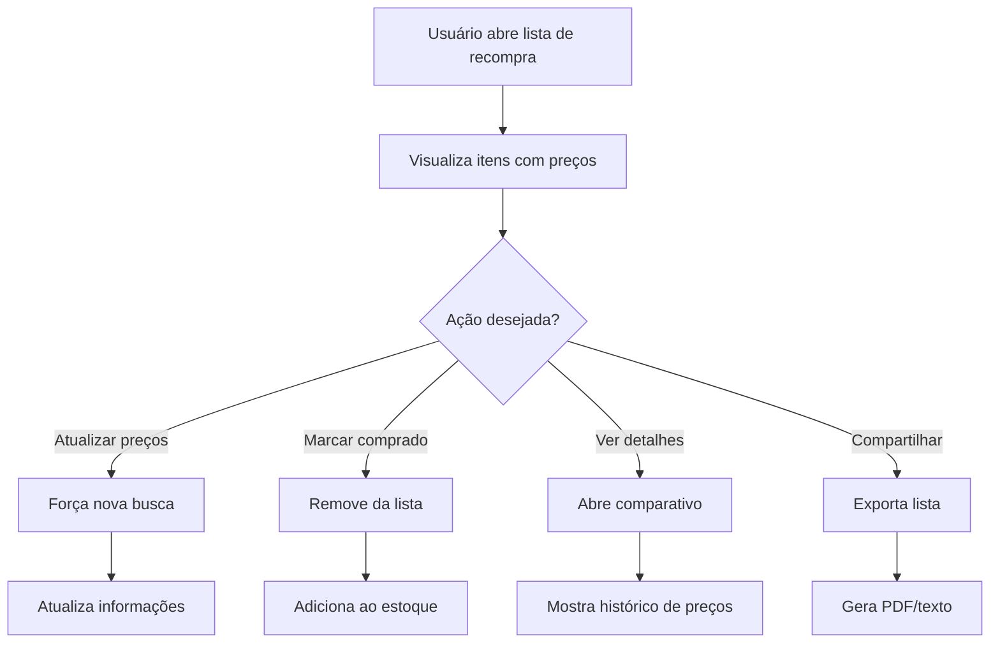

# Especificação Técnica: PWA Gerenciador de Estoque de Supermercado

## 📋 Visão Geral do Projeto

Sistema Progressive Web App (PWA) para gerenciamento inteligente de estoque doméstico baseado em compras de supermercado, com funcionalidades de OCR para leitura de recibos e comparação automática de preços em tempo real.

---

## 🎯 Objetivos do Sistema

1. **Automatizar** a entrada de dados de compras através de OCR de recibos
2. **Gerenciar** estoque doméstico de produtos de supermercado
3. **Comparar** preços automaticamente ao dar baixa em produtos
4. **Sugerir** melhores momentos e locais para recompra
5. **Economizar** dinheiro através de análise comparativa de preços

---

## 🔧 Funcionalidades Detalhadas

### 1. Captura e Processamento de Recibos (OCR)

**Entrada:**
- Upload de foto do recibo de compra (câmera ou galeria)
- Formatos suportados: JPG, PNG, PDF

**Processamento:**
- Utilizar OCR/Vision AI para extrair:
  - Nome do estabelecimento
  - Data da compra
  - Lista completa de itens
  - Preço unitário de cada item
  - Quantidade comprada
  - Valor total da compra

**Saída:**
- Dados estruturados em formato JSON
- Interface de revisão/edição manual dos dados extraídos
- Confirmação antes de adicionar ao estoque

**Tecnologias Sugeridas:**
- Google Cloud Vision API
- Tesseract.js (OCR offline)
- OpenAI Vision API
- Azure Computer Vision

---

### 2. Gestão de Estoque Digital

**Funcionalidades:**

#### 2.1 Inventário Digital
- Listar todos os produtos em estoque
- Exibir informações:
  - Nome do produto
  - Quantidade atual
  - Preço pago
  - Data de compra
  - Estabelecimento de origem
  - Status (disponível/acabando/acabou)

#### 2.2 Dar Baixa em Produtos
- Interface simples para marcar produto como "acabou"
- Registrar data de esgotamento
- **TRIGGER**: Iniciar busca automática de preços

#### 2.3 Histórico de Consumo
- Calcular tempo médio de consumo por produto
- Prever quando produto acabará novamente
- Sugerir quantidade ideal para próxima compra

**Estrutura de Dados:**
```json
{
  "id": "uuid",
  "nome": "Arroz Tipo 1 5kg",
  "categoria": "Grãos",
  "quantidade": 1,
  "unidade": "pacote",
  "precoUnitario": 25.90,
  "precoTotal": 25.90,
  "estabelecimento": "Supermercado XYZ",
  "dataCompra": "2024-01-15",
  "dataEsgotamento": null,
  "status": "disponivel",
  "historicoConsumo": []
}
```

---

### 3. Busca Automática de Preços (CORE FEATURE)

**Trigger:**
- Quando usuário der baixa em um item

**Processo:**

#### 3.1 Busca Inteligente
1. Normalizar nome do produto (remover marcas específicas se necessário)
2. Buscar em múltiplas fontes:
   - Site do supermercado original (se disponível)
   - Sites de outros supermercados da região
   - Google Shopping
   - APIs de comparação de preços (Buscapé, Zoom, etc.)

#### 3.2 Coleta de Dados
- Nome do produto encontrado
- Preço atual
- Estabelecimento
- Link para compra (se disponível)
- Data e hora da consulta
- Disponibilidade (em estoque/fora de estoque)

#### 3.3 Cache e Otimização
- Armazenar resultados por 24 horas
- Evitar buscas repetidas no mesmo dia
- Permitir atualização manual forçada

**Tecnologias Sugeridas:**
- Puppeteer/Playwright para web scraping
- APIs de supermercados (se disponíveis)
- Google Shopping API
- Serviços de proxy para evitar bloqueios

**Estrutura de Dados:**
```json
{
  "produtoId": "uuid",
  "buscas": [
    {
      "id": "uuid",
      "dataBusca": "2024-01-20T10:30:00",
      "resultados": [
        {
          "estabelecimento": "Supermercado ABC",
          "preco": 23.50,
          "link": "https://...",
          "disponivel": true
        },
        {
          "estabelecimento": "Supermercado XYZ",
          "preco": 25.90,
          "link": "https://...",
          "disponivel": true
        }
      ]
    }
  ]
}
```

---

### 4. Análise Comparativa Inteligente

**Comparações:**

#### 4.1 Comparação de Preço
- Preço pago anteriormente vs. Preço atual encontrado
- Calcular variação percentual
- Identificar tendência (subindo/descendo/estável)

#### 4.2 Indicadores Visuais
- 🟢 **Mais barato**: Economia > 5%
  - Exibir: "Economize R$ X,XX (Y%)"
- 🔴 **Mais caro**: Aumento > 5%
  - Exibir: "Aumento de R$ X,XX (Y%)"
- 🟡 **Preço similar**: Variação entre -5% e +5%
  - Exibir: "Preço estável"

#### 4.3 Recomendações
- Melhor local para comprar (menor preço)
- Sugestão de momento ideal:
  - "Compre agora - preço 15% menor"
  - "Aguarde - preço em alta"
  - "Preço normal - compre quando precisar"

**Interface:**
```
┌─────────────────────────────────────┐
│ Arroz Tipo 1 5kg                    │
├─────────────────────────────────────┤
│ Último preço pago: R$ 25,90         │
│ Supermercado XYZ - 15/01/2024       │
├─────────────────────────────────────┤
│ 🟢 Melhor preço encontrado:         │
│ R$ 23,50 no Supermercado ABC        │
│ Economize R$ 2,40 (9.3%)            │
├─────────────────────────────────────┤
│ Outros preços:                      │
│ • R$ 24,90 - Mercado DEF            │
│ • R$ 25,90 - Supermercado XYZ       │
│ • R$ 26,50 - Loja GHI               │
└─────────────────────────────────────┘
```

---

### 5. Lista de Recompra Inteligente

**Funcionalidades:**

#### 5.1 Geração Automática
- Adicionar automaticamente itens que acabaram
- Ordenar por:
  - Prioridade (baseado em frequência de uso)
  - Economia potencial
  - Categoria

#### 5.2 Informações por Item
- Nome do produto
- Último preço pago
- Preço atual (melhor encontrado)
- Diferença percentual
- Melhor local para comprar
- Data da última busca
- Tempo médio de consumo
- Sugestão de quantidade

#### 5.3 Ações Disponíveis
- Marcar como comprado
- Remover da lista
- Atualizar preços manualmente
- Compartilhar lista
- Exportar (PDF, texto)

**Interface da Lista:**
```
┌─────────────────────────────────────┐
│ LISTA DE RECOMPRA                   │
│ Atualizada em: 20/01/2024 10:30     │
├─────────────────────────────────────┤
│ ☐ Arroz Tipo 1 5kg                  │
│   Último: R$ 25,90 → Atual: R$ 23,50│
│   🟢 Economize 9.3%                  │
│   📍 Supermercado ABC                │
│   📊 Dura ~30 dias                   │
├─────────────────────────────────────┤
│ ☐ Feijão Preto 1kg                  │
│   Último: R$ 8,50 → Atual: R$ 9,20  │
│   🔴 Aumento de 8.2%                 │
│   📍 Mercado DEF (melhor opção)      │
│   📊 Dura ~20 dias                   │
└─────────────────────────────────────┘
```

---

## 🏗️ Arquitetura Técnica

### Stack Tecnológico Recomendado

#### Frontend
- **Framework**: React + Vite ou Next.js
- **UI Library**: Material-UI, Shadcn/ui, ou Tailwind CSS
- **State Management**: Zustand ou Redux Toolkit
- **PWA**: Workbox (service workers)
- **Camera**: HTML5 Media Capture API

#### Backend/Serviços
- **OCR**: 
  - Google Cloud Vision API (pago, alta precisão)
  - Tesseract.js (gratuito, offline)
  - OpenAI Vision API (pago, muito preciso)
- **Web Scraping**: 
  - Puppeteer/Playwright
  - Cheerio (parsing HTML)
- **APIs de Preços**:
  - Google Shopping API
  - APIs de supermercados (se disponíveis)

#### Banco de Dados
- **Local**: IndexedDB (via Dexie.js)
- **Sincronização**: Firebase, Supabase, ou PocketBase
- **Cache**: Service Worker Cache API

#### Hospedagem
- **Frontend**: Vercel, Netlify, ou Cloudflare Pages
- **Backend/APIs**: Vercel Functions, Netlify Functions, ou Railway

---

## 📊 Estrutura de Dados Completa

### Tabelas/Collections

#### 1. Produtos
```typescript
interface Produto {
  id: string;
  nome: string;
  categoria: string;
  marca?: string;
  quantidade: number;
  unidade: string; // 'unidade', 'kg', 'litro', 'pacote'
  precoUnitario: number;
  precoTotal: number;
  estabelecimento: string;
  dataCompra: Date;
  dataEsgotamento?: Date;
  status: 'disponivel' | 'acabando' | 'acabou';
  reciboId: string;
  imagemUrl?: string;
}
```

#### 2. Recibos
```typescript
interface Recibo {
  id: string;
  estabelecimento: string;
  dataCompra: Date;
  valorTotal: number;
  imagemUrl: string;
  dadosOCR: any; // dados brutos do OCR
  processado: boolean;
  dataUpload: Date;
}
```

#### 3. Buscas de Preços
```typescript
interface BuscaPreco {
  id: string;
  produtoId: string;
  dataBusca: Date;
  resultados: ResultadoBusca[];
  melhorPreco: ResultadoBusca;
}

interface ResultadoBusca {
  estabelecimento: string;
  preco: number;
  link?: string;
  disponivel: boolean;
  dataConsulta: Date;
}
```

#### 4. Histórico de Consumo
```typescript
interface HistoricoConsumo {
  id: string;
  produtoId: string;
  dataCompra: Date;
  dataEsgotamento: Date;
  diasConsumo: number;
  precoCompra: number;
  quantidade: number;
}
```

#### 5. Lista de Recompra
```typescript
interface ItemRecompra {
  id: string;
  produtoId: string;
  adicionadoEm: Date;
  prioridade: 'alta' | 'media' | 'baixa';
  comprado: boolean;
  dataCompra?: Date;
  ultimaBuscaPreco?: Date;
}
```

---

## 🔄 Fluxos de Uso Detalhados

### Fluxo 1: Adicionar Compra via Recibo



### Fluxo 2: Dar Baixa e Buscar Preços



### Fluxo 3: Gerenciar Lista de Recompra



---

## 🎨 Interface do Usuário (UI/UX)

### Telas Principais

#### 1. Dashboard/Home
- Resumo do estoque (total de itens)
- Produtos acabando (alertas)
- Última compra adicionada
- Atalhos rápidos:
  - Adicionar compra
  - Ver lista de recompra
  - Dar baixa rápida

#### 2. Estoque
- Lista de todos os produtos
- Filtros por:
  - Categoria
  - Estabelecimento
  - Status
  - Data de compra
- Busca por nome
- Ações rápidas (dar baixa, editar, excluir)

#### 3. Adicionar Compra
- Botão grande "Fotografar Recibo"
- Opção "Escolher da Galeria"
- Histórico de recibos processados

#### 4. Revisão de OCR
- Imagem do recibo
- Dados extraídos editáveis
- Botão confirmar/cancelar

#### 5. Lista de Recompra
- Itens ordenados por prioridade
- Indicadores visuais de economia
- Botão "Atualizar todos os preços"
- Opção de compartilhar/exportar

#### 6. Detalhes do Produto
- Informações completas
- Gráfico de histórico de preços
- Histórico de consumo
- Comparativo de estabelecimentos

#### 7. Configurações
- Região/localização (para busca de preços)
- Preferências de notificação
- Gerenciar categorias
- Exportar/importar dados

---

## 🔔 Sistema de Notificações

### Tipos de Notificações

1. **Preço em Queda**
   - "Arroz está 15% mais barato no Supermercado ABC!"
   
2. **Produto Acabando**
   - "Você tem 3 itens acabando. Ver lista de recompra?"

3. **Melhor Momento para Comprar**
   - "Feijão está no menor preço dos últimos 30 dias!"

4. **Lembrete de Recompra**
   - "Baseado no seu consumo, o café deve acabar em 3 dias"

---

## 🚀 Roadmap de Desenvolvimento

### Fase 1: MVP (Mínimo Produto Viável)
- [ ] Setup do projeto PWA
- [ ] Interface básica (Dashboard, Estoque, Adicionar)
- [ ] Banco de dados local (IndexedDB)
- [ ] Upload de foto de recibo
- [ ] Integração OCR básica
- [ ] Adicionar produtos manualmente
- [ ] Dar baixa em produtos
- [ ] Lista de recompra simples

### Fase 2: Busca de Preços
- [ ] Implementar web scraping básico
- [ ] Busca automática ao dar baixa
- [ ] Comparação de preços
- [ ] Indicadores visuais (mais barato/caro)
- [ ] Cache de resultados

### Fase 3: Inteligência
- [ ] Histórico de consumo
- [ ] Previsão de esgotamento
- [ ] Sugestões de quantidade
- [ ] Análise de tendências de preço
- [ ] Gráficos e relatórios

### Fase 4: Melhorias
- [ ] Sistema de notificações
- [ ] Sincronização em nuvem
- [ ] Compartilhamento de listas
- [ ] Categorização automática
- [ ] Suporte a múltiplos usuários/famílias
- [ ] Modo offline completo

---

## ⚠️ Considerações Importantes

### Desafios Técnicos

1. **OCR de Recibos**
   - Recibos têm formatos variados
   - Qualidade da foto pode afetar precisão
   - Necessário pós-processamento e validação

2. **Web Scraping**
   - Sites podem bloquear bots
   - Estrutura HTML muda frequentemente
   - Necessário manutenção constante
   - Considerar aspectos legais

3. **Matching de Produtos**
   - Mesmo produto pode ter nomes diferentes
   - Necessário normalização inteligente
   - Considerar variações de marca/tamanho

4. **Performance**
   - Buscas podem ser lentas
   - Necessário sistema de cache eficiente
   - Processar OCR pode consumir recursos

### Aspectos Legais

- Verificar termos de uso dos sites para scraping
- Considerar usar APIs oficiais quando disponíveis
- Respeitar robots.txt
- Implementar rate limiting

### Privacidade

- Dados sensíveis (compras) devem ficar locais
- Se usar sincronização, criptografar dados
- Não compartilhar dados com terceiros
- Política de privacidade clara

---

## 📱 Requisitos PWA

### Funcionalidades PWA Essenciais

1. **Instalável**
   - Manifest.json configurado
   - Ícones em múltiplos tamanhos
   - Splash screen

2. **Offline First**
   - Service Worker para cache
   - Funcionar sem internet (exceto busca de preços)
   - Sincronização em background

3. **Responsivo**
   - Mobile-first design
   - Funcionar em tablets e desktop
   - Touch-friendly

4. **Performance**
   - Carregamento rápido
   - Transições suaves
   - Otimização de imagens

---

## 🎯 Métricas de Sucesso

- Tempo médio para adicionar uma compra: < 2 minutos
- Precisão do OCR: > 85%
- Taxa de sucesso na busca de preços: > 70%
- Economia média identificada: > 10% por lista
- Tempo de carregamento: < 3 segundos
- Uso offline: 100% das funcionalidades básicas

---

## 📚 Recursos e Referências

### APIs e Serviços
- Google Cloud Vision API
- Tesseract.js
- Puppeteer
- Workbox (PWA)

### Inspirações de Design
- Apps de lista de compras
- Apps de controle financeiro
- Apps de cupons/cashback

### Bibliotecas Úteis
- Dexie.js (IndexedDB)
- Chart.js (gráficos)
- date-fns (manipulação de datas)
- Zod (validação de dados)

---

## 💡 Funcionalidades Futuras (Ideias)

- Integração com programas de fidelidade
- Alertas de promoções
- Receitas baseadas no estoque
- Compartilhamento familiar
- Estatísticas de gastos
- Exportação para planilhas
- Integração com delivery
- Scanner de código de barras
- Reconhecimento de marcas específicas
- Sugestões de substituição (produtos similares mais baratos)
